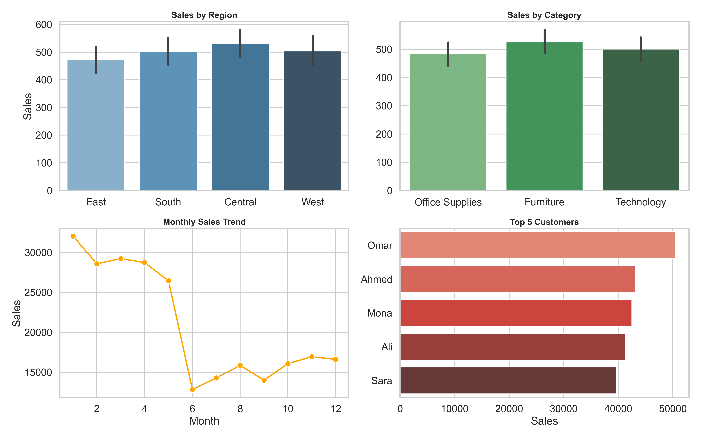

# 📊 Sales & Customer Analysis

## 🧠 Project Overview
This project focuses on analyzing sales data to understand customer behavior and evaluate overall business performance.  
The objective is to uncover key insights that can support data-driven decision-making and improve revenue growth.

---

## 🎯 Business Objectives
- Identify high-value customers and revenue drivers  
- Analyze sales performance across regions and categories  
- Understand customer purchasing behavior  
- Detect trends and patterns over time  

---

## 🛠 Tools & Technologies
- Python (Pandas, NumPy)  
- Data Visualization (Seaborn, Matplotlib)  

---

## 🔍 Key Analysis Performed
- Data cleaning and preprocessing to ensure data quality  
- Exploratory Data Analysis (EDA) to identify trends and patterns  
- Customer segmentation based on total sales (High / Medium / Low)  
- KPI calculation:
  - Total Sales  
  - Total Orders  
  - Average Order Value (AOV)  

---

## 📊 Dashboard Visualization

---

## 💡 Key Insights
- A small percentage of customers contributes to the majority of total revenue  
- High-value customers have significantly higher purchase frequency and spending  
- Certain regions consistently outperform others in terms of sales  
- Sales trends indicate patterns across different periods  

---

## 🚀 Business Recommendations
- Focus marketing efforts on high-value customers to maximize revenue  
- Invest more in top-performing regions  
- Promote best-selling products to increase sales performance  
- Improve engagement strategies for low-value customers  

---

## 📈 Project Impact
This analysis provides clear visibility into customer behavior and business performance, enabling better strategic decisions and revenue optimization.

---

## 🔗 Future Improvements
- Build an interactive dashboard using Power BI or Tableau  
- Apply predictive analytics for sales forecasting  
- Perform deeper customer segmentation using machine learning  

---

⭐ If you found this project useful, feel free to give it a star!
